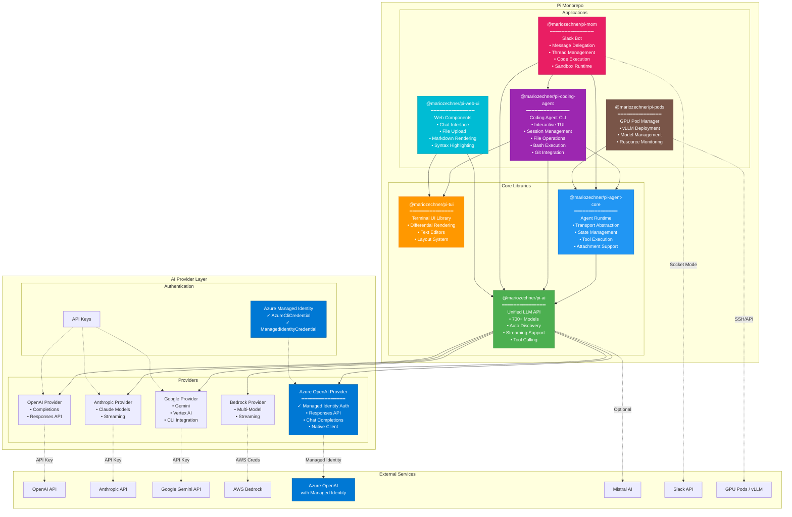
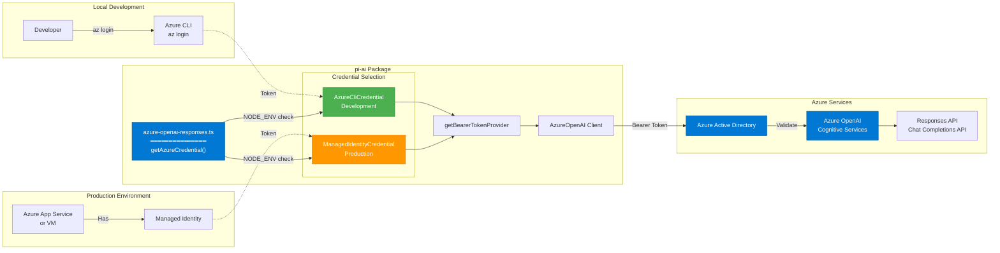
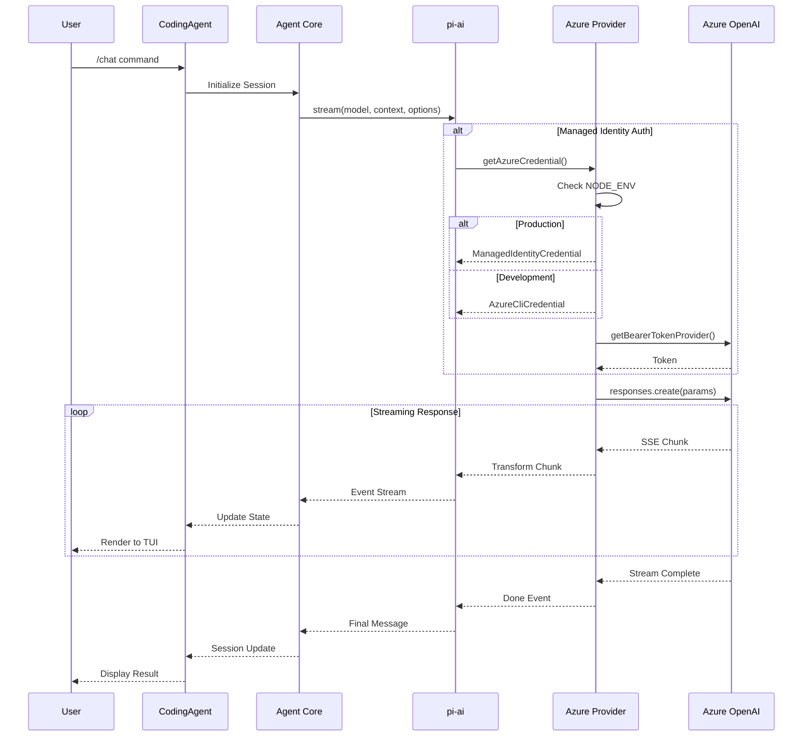
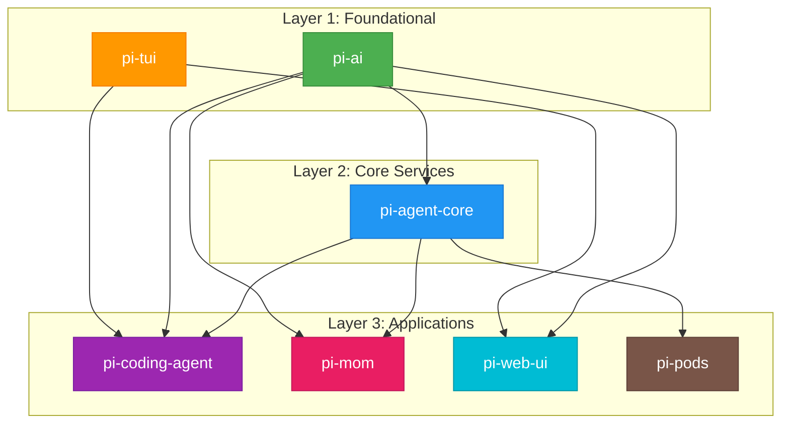
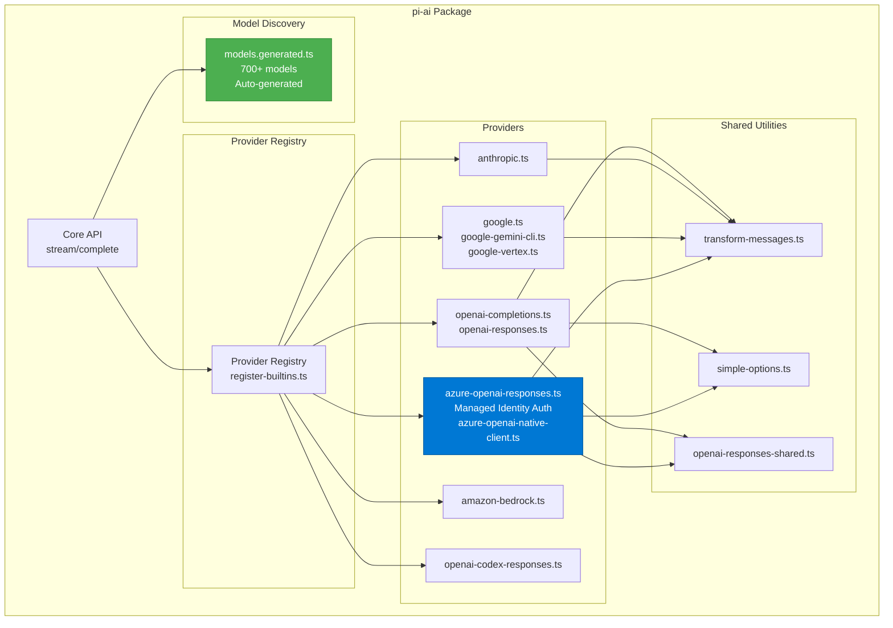
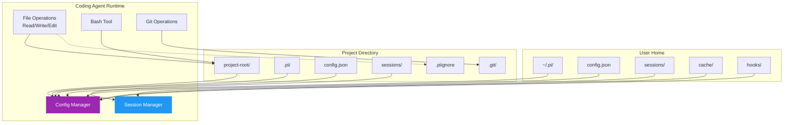

# Pi Monorepo Architecture

## Overview
Pi is a monorepo containing 7 interconnected packages for building AI agents and managing LLM deployments. The architecture follows a layered approach with clear separation of concerns.

## System Architecture



## Azure OpenAI Managed Identity Architecture



## Data Flow Architecture



## Package Dependency Graph



## Provider Architecture (pi-ai)



## File System Architecture (Coding Agent)



## Key Features by Package

### 1. @mariozechner/pi-ai
- **Multi-Provider Support**: 700+ models across 17 providers
- **Streaming**: First-class streaming support with SSE
- **Tool Calling**: Unified tool/function calling interface
- **Model Discovery**: Auto-generated model catalog
- **Cost Tracking**: Token usage and cost estimation
- **Cache Management**: Prompt caching support
- **Azure Integration**: ✓ Managed Identity authentication (NEW)

### 2. @mariozechner/pi-agent-core
- **Transport Abstraction**: Pluggable I/O layer
- **State Management**: Conversation and tool state
- **Attachment Support**: File and image handling
- **Event System**: Typed event emission
- **Tool Execution**: Async tool call handling

### 3. @mariozechner/pi-coding-agent
- **Interactive TUI**: Full-featured terminal interface
- **Session Management**: Save/restore conversations
- **File Operations**: Read, Write, Edit with diff support
- **Bash Execution**: Safe command execution with sandboxing
- **Git Integration**: Commit creation, PR generation
- **Context Management**: Smart file inclusion
- **Extension System**: Custom tools and providers

### 4. @mariozechner/pi-mom
- **Slack Integration**: Socket mode for real-time messages
- **Thread Management**: Conversation threading
- **Sandbox Execution**: Safe code execution with E2B
- **Scheduled Tasks**: Cron-based job execution
- **Multi-Channel**: Support multiple Slack workspaces

### 5. @mariozechner/pi-tui
- **Differential Rendering**: Efficient screen updates
- **Text Editors**: Full-featured text input components
- **Layout System**: Flexbox-like terminal layouts
- **Markdown Rendering**: Terminal-based markdown display
- **Syntax Highlighting**: Code syntax coloring

### 6. @mariozechner/pi-web-ui
- **Web Components**: Lit-based reusable components
- **Chat Interface**: Full-featured chat UI
- **File Upload**: Drag-and-drop file support
- **Document Preview**: PDF, DOCX, XLSX rendering
- **Syntax Highlighting**: Code block rendering
- **Dark/Light Theme**: Theme support

### 7. @mariozechner/pi-pods
- **vLLM Deployment**: GPU pod orchestration
- **Model Management**: Download and configure models
- **Resource Monitoring**: GPU utilization tracking
- **SSH Integration**: Remote pod management

## Security Features

### Azure OpenAI Managed Identity (Implemented)
```
✓ No API keys in code
✓ Azure AD authentication
✓ Automatic token refresh
✓ Development/Production modes
✓ Least privilege access
✓ Audit trail
```

### Other Security Features
- **API Key Management**: Environment-based configuration
- **Sandboxing**: Safe code execution in Mom
- **.piignore**: Prevent sensitive file access
- **Git Safety**: No force operations without explicit consent
- **Bash Safety**: No destructive commands by default

## Performance Optimizations

1. **Streaming**: All providers support streaming responses
2. **Caching**: Prompt caching for repeated context
3. **Differential Rendering**: Only redraw changed terminal regions
4. **Lazy Loading**: Models loaded on-demand
5. **Connection Pooling**: Reuse HTTP connections
6. **Batch Operations**: Group file operations

## Development Workflow

```
npm install          # Install dependencies
npm run build        # Build all packages
npm run dev          # Watch mode for all packages
npm run check        # Lint, format, type check
npm test            # Run test suites
```

## Technology Stack

- **Language**: TypeScript 5.7+
- **Runtime**: Node.js 20+
- **Build**: Custom tsgo compiler
- **Testing**: Vitest
- **Linting**: Biome
- **UI**: Terminal (blessed-like), Web (Lit)
- **AI SDKs**: Official provider SDKs
- **Authentication**: Azure Identity SDK

## Version

Current Version: **0.52.9**

Last Updated: February 11, 2026
